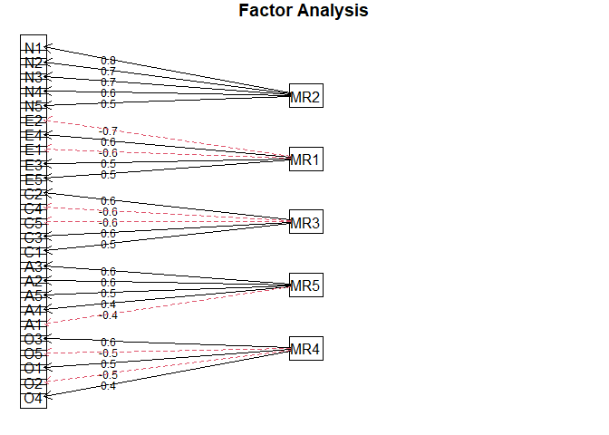
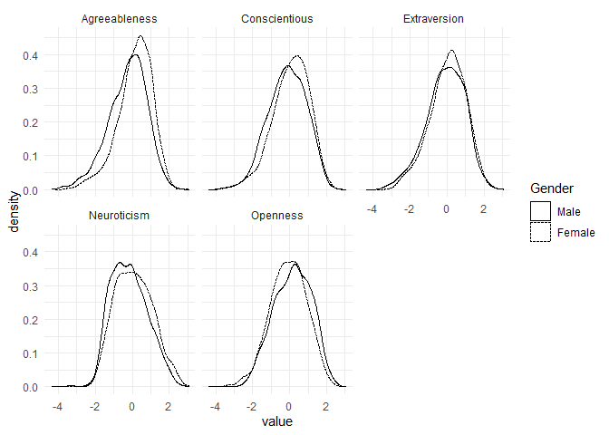

<!-- README.md is generated from README.Rmd. Please edit that file -->

# mifa

<!-- badges: start -->

[](https://www.tidyverse.org/lifecycle/#experimental)
[](https://github.com/teebusch/mifa/actions)
<!-- badges: end -->

`mifa` implements multiple imputation for exploratory factor analysis to
allow performing exploratory factor analysis on data sets with missing
data. It works as follows:

-   `mifa` imputes the missing values multiple times using Multivariate
    Imputation with Chained Equations (MICE) from the [mice
    package](https://amices.org/mice/).

-   It then combines the covariance matrices of the imputed data sets
    into a single estimated covariance matrix using Rubin’s rules.

-   This combined covariance matrix can then be used to perform
    exploratory factor analyis.

-   `mifa` also provides two types of confidence intervals for the
    variance explained by different numbers of factors: Parametric
    Fieller confidence intervals for larger samples, and nonparametric
    bootstrapped confidence intervals for smaller samples.

**For more information, see:**

Nassiri, V., Lovik, A., Molenberghs, G., Verbeke, G. (2018) On using
multiple imputation for exploratory factor analysis of incomplete data.
*Behavior Research Methods* 50, 501–517.
<https://doi.org/10.3758/s13428-017-1013-4>

## Installation

You can install the the developmental version of `mifa` with:

You can install the the release version of `mifa` from
[GitHub](https://github.com/teebusch/mifa) with:

``` r
# install.packages("devtools")
devtools::install_github("teebusch/mifa")
```

``` r
# install.packages("devtools")
devtools::install_github("teebusch/mifa@dev")
```

The original version of mifa appears to have been abandoned by the
author. You can find it [here](https://github.com/vahidnassiri/mifa).

## Usage

As an example, we use the `bfi` data set from the `psych` package. It
contains data from 2800 subjects: Their answers to 25 personality self
report items and 3 demographic variables (sex, education, and age).

The 25 columns with responses to personality questions are already
grouped into 5 personality factors, as indicated by their names:

-   **A1-A5** Agreeableness
-   **C1-C5** Conscientiousness
-   **E1-E5** Extraversion
-   **N1-N5** Neuroticism
-   **O1-O5** Openness

In most columns there are a couple of missing values.

``` r
library(psych)
#> Warning: package 'psych' was built under R version 4.0.3
data <- bfi[, 1:25] # exclude gender, education, and age
colSums(is.na(data))
#> A1 A2 A3 A4 A5 C1 C2 C3 C4 C5 E1 E2 E3 E4 E5 N1 N2 N3 N4 N5 O1 O2 O3 O4 O5 
#> 16 27 26 19 16 21 24 20 26 16 23 16 25  9 21 22 21 11 36 29 22  0 28 14 20
```

``` r
library(mifa)
mi <- mifa(data, n_factors = 2:8, ci = "both", n_boot = 50, print = FALSE)

summary(mi)
#>                 Length Class      Mode   
#> cov_combined    625    -none-     numeric
#> cov_imputations   5    -none-     list   
#> var_explained     6    data.frame list
```

The Fieller and bootstrap confidence intervals indicate that 5 factors
are enough to explain more than half of the variance:

``` r
round(mi$var_explained, 2)
#>   n_factors var_explained ci_boot_lower ci_boot_upper ci_fieller_lower
#> 1         2          0.33          0.32          0.34             0.32
#> 2         3          0.41          0.41          0.42             0.40
#> 3         4          0.48          0.48          0.49             0.47
#> 4         5          0.54          0.53          0.55             0.53
#> 5         6          0.58          0.58          0.59             0.58
#> 6         7          0.62          0.62          0.63             0.61
#> 7         8          0.66          0.65          0.67             0.65
#>   ci_fieller_upper
#> 1             0.34
#> 2             0.42
#> 3             0.49
#> 4             0.55
#> 5             0.59
#> 6             0.63
#> 7             0.66
```

The estimated covariance matrix based on imputed data is in
`mi$cov_combined`, and we can use it to perform exploratory factor
analysis with the desired number of factors. We use the `fa()` function
from `psych` for this:

``` r
fit <- fa(r = mi$cov_combined, n.obs = nrow(data), nfactors = 5, 
          rotate = "varimax")
fit
#> Factor Analysis using method =  minres
#> Call: fa(r = mi$cov_combined, nfactors = 5, n.obs = nrow(data), rotate = "varimax")
#> Standardized loadings (pattern matrix) based upon correlation matrix
#>      MR2   MR1   MR3   MR5   MR4   h2   u2 com
#> A1  0.12  0.04  0.02 -0.41 -0.08 0.19 0.81 1.3
#> A2  0.03  0.21  0.14  0.61  0.07 0.45 0.55 1.4
#> A3  0.01  0.32  0.11  0.63  0.06 0.52 0.48 1.6
#> A4 -0.06  0.19  0.23  0.42 -0.11 0.28 0.72 2.2
#> A5 -0.11  0.39  0.09  0.53  0.06 0.46 0.54 2.0
#> C1  0.01  0.06  0.53  0.03  0.20 0.33 0.67 1.3
#> C2  0.09  0.03  0.65  0.11  0.11 0.45 0.55 1.2
#> C3 -0.02  0.02  0.55  0.12  0.00 0.32 0.68 1.1
#> C4  0.25 -0.06 -0.61 -0.04 -0.11 0.45 0.55 1.5
#> C5  0.30 -0.17 -0.55 -0.05  0.03 0.43 0.57 1.8
#> E1  0.04 -0.57  0.04 -0.10 -0.07 0.35 0.65 1.1
#> E2  0.25 -0.68 -0.09 -0.10 -0.04 0.54 0.46 1.3
#> E3  0.02  0.54  0.08  0.26  0.27 0.44 0.56 2.0
#> E4 -0.10  0.65  0.10  0.30 -0.08 0.53 0.47 1.6
#> E5  0.03  0.50  0.32  0.09  0.21 0.41 0.59 2.2
#> N1  0.77  0.08 -0.04 -0.22 -0.08 0.66 0.34 1.2
#> N2  0.75  0.03 -0.03 -0.19 -0.02 0.60 0.40 1.1
#> N3  0.73 -0.06 -0.07 -0.03  0.00 0.55 0.45 1.0
#> N4  0.59 -0.33 -0.17  0.00  0.07 0.49 0.51 1.8
#> N5  0.54 -0.15 -0.03  0.10 -0.15 0.35 0.65 1.4
#> O1  0.01  0.22  0.12  0.06  0.50 0.31 0.69 1.6
#> O2  0.19  0.00 -0.10  0.09 -0.45 0.26 0.74 1.5
#> O3  0.02  0.30  0.08  0.13  0.59 0.46 0.54 1.7
#> O4  0.23 -0.18 -0.01  0.16  0.38 0.25 0.75 2.6
#> O5  0.10 -0.01 -0.06 -0.02 -0.53 0.30 0.70 1.1
#> 
#>                        MR2  MR1  MR3  MR5  MR4
#> SS loadings           2.69 2.45 1.97 1.77 1.47
#> Proportion Var        0.11 0.10 0.08 0.07 0.06
#> Cumulative Var        0.11 0.21 0.28 0.36 0.41
#> Proportion Explained  0.26 0.24 0.19 0.17 0.14
#> Cumulative Proportion 0.26 0.50 0.69 0.86 1.00
#> 
#> Mean item complexity =  1.5
#> Test of the hypothesis that 5 factors are sufficient.
#> 
#> The degrees of freedom for the null model are  300  and the objective function was  7.22 with Chi Square of  20152.18
#> The degrees of freedom for the model are 185  and the objective function was  0.66 
#> 
#> The root mean square of the residuals (RMSR) is  0.03 
#> The df corrected root mean square of the residuals is  0.04 
#> 
#> The harmonic number of observations is  2800 with the empirical chi square  1434.83  with prob <  4.8e-192 
#> The total number of observations was  2800  with Likelihood Chi Square =  1835.32  with prob <  3.1e-269 
#> 
#> Tucker Lewis Index of factoring reliability =  0.865
#> RMSEA index =  0.056  and the 90 % confidence intervals are  0.054 0.059
#> BIC =  366.9
#> Fit based upon off diagonal values = 0.98
#> Measures of factor score adequacy             
#>                                                    MR2  MR1  MR3  MR5  MR4
#> Correlation of (regression) scores with factors   0.92 0.88 0.86 0.84 0.82
#> Multiple R square of scores with factors          0.85 0.77 0.73 0.70 0.67
#> Minimum correlation of possible factor scores     0.70 0.54 0.47 0.40 0.35
```

The plot below shows that the five factors have been recovered quite
well:

``` r
fa.diagram(fit)
```

 We
can extract the factor scores and add them to the original data:

``` r
# impute a single data set with mice
imp <- mice::mice(bfi, m = 1, print = FALSE)
data_imp <- mice::complete(imp, 1)

# get factor scores for original data
fct_scores <- data.frame(factor.scores(data_imp[, 1:25], fit)$scores)

data_imp <- data.frame(
  Gender        = factor(data_imp$gender),
  Extraversion  = fct_scores$MR1,
  Neuroticism   = fct_scores$MR2,
  Conscientious = fct_scores$MR3,
  Openness      = fct_scores$MR4,
  Agreeableness = fct_scores$MR5
)

levels(data_imp$Gender) <- c("Male", "Female")
```

``` r
library(ggplot2)
library(tidyr)

data_imp <- tidyr::pivot_longer(data_imp, -Gender, "factor")

ggplot(data_imp, aes(value, linetype = Gender)) +
  geom_density() +
  facet_wrap(~ factor, nrow = 2)
```


